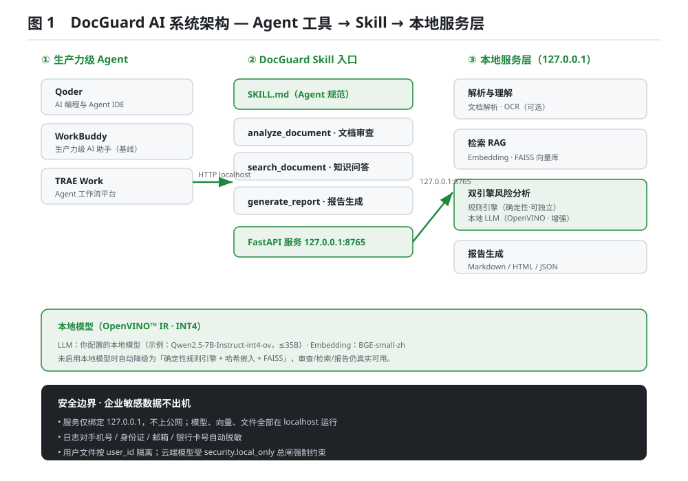
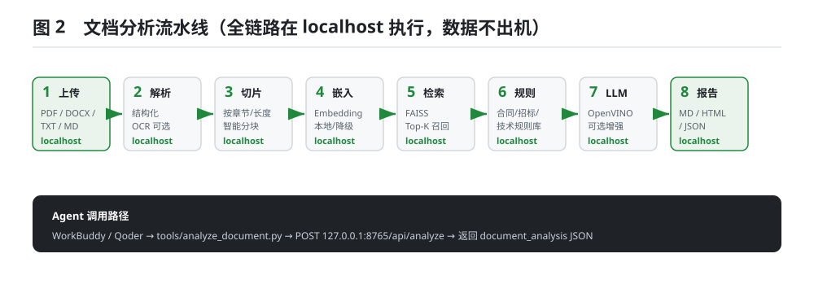
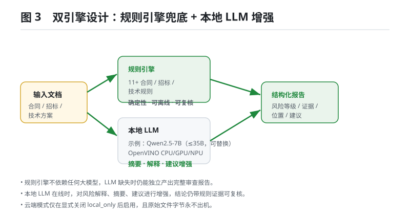
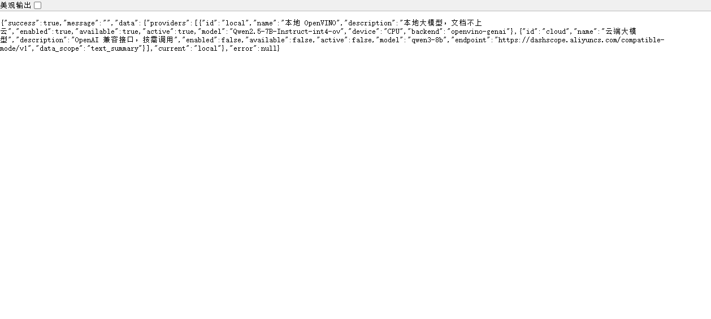
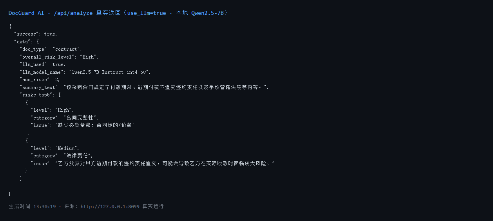

# DocGuard AI — 企业文档智能审查 Agent Skill

> 运行在 AI PC 上的企业文档智能审查助手：本地优先，端云协同，数据可控。

DocGuard AI 是一个面向生产力级 AI Agent（Qoder / WorkBuddy / TRAE Work）的本地 Skill，
通过 **OCR + RAG + 文档理解 + 风险分析 + 报告生成** 流水线，为企业法务、采购、技术、项目、咨询人员
提供可落地的文档智能审查能力。所有本地模型与文件均在 `127.0.0.1` 运行，企业敏感数据**默认不上传任何云端**，
底层由 **OpenVINO™** 优化本地推理，支持 Intel **CPU / GPU / NPU**；必要时可显式启用**端云协同**（OpenAI 兼容接口），
仅上传脱敏后的文本摘要/检索片段，**原始文件字节永不出机**。

---

## 目录速览

- **[运行必需](#file-checklist)**：`SKILL.md` · `info.json` · `meta.json` · `model_config.yaml` · `requirements.txt`
- **[核心代码](#architecture)**：`scripts/`（宿主入口 `run.ps1`、模型转换、基准、契约入口 `client.py`/`server.py`）· `tools/`（Agent 调用入口）· `server/`（FastAPI 本地服务）
- **[样例与示例](#quickstart)**：`examples/`（合同/招标/技术方案样例 + `demo_client.py` 最小客户端示例）
- **[文档配图](#screenshots)**：`assets/`（SVG 架构图 + 真实运行截图）
- **[测试](#tests)**：`tests/`
- **[开发验证脚本](#project-structure)**：`verify_e2e.py` / `verify_pdf.py` 统一置于 `scripts/` 下，不在根目录平铺。

---

## 一、核心能力

| 功能 | 输入 | 输出 |
|---|---|---|
| **企业合同风险审查** | 合同 PDF / DOCX / TXT | 合同摘要 · 风险等级（Low/Medium/High）· 风险清单（问题/位置/说明/建议） |
| **招标文件分析** | 招标文件 | 项目要求 · 企业匹配度 · 缺失能力 · 风险提醒 |
| **技术方案审查** | 技术方案 / PRD | 架构缺陷 · 安全问题 · 性能风险 · 章节完整性 |
| **企业知识问答（RAG）** | 自然语言问题 | 基于文档检索增强的回答 + 引用来源 |
| **文档对比** | 两个版本文档 | 差异分析（新增/删除/修改/未变） |

所有按钮、所有接口均对接真实后端逻辑，**无空页面、无假数据、无模拟 AI 输出**。

---

## 二、为什么选 DocGuard

- **本地优先**：默认只使用 localhost，断网可用；模型、向量、文件全部留在本机。
- **双引擎兜底**：规则引擎可独立于大模型产出完整审查报告；本地 LLM 在线时进行增强，结论仍带规则证据可复核。
- **真·端侧推理**：通过 OpenVINO 子进程加载你自行准备的本地模型（示例：Qwen2.5-7B-Instruct-int4-ov，≤35B 均可），`do_sample=False`，确定性高。
- **安全边界**：服务仅绑定 `127.0.0.1`，日志自动脱敏，用户目录隔离；`security.local_only` 作为总闸禁止任何云端绕过。
- **生产力级入口**：SKILL.md 已定义三个 Tool，Qoder / WorkBuddy / TRAE Work 可直接调用。

---

<a name="architecture"></a>

## 三、系统架构



上图展示了 DocGuard 的三层结构：

1. **生产力级 Agent**：Qoder、WorkBuddy、TRAE Work 通过 SKILL.md 定义的 Tool 调用 Skill。
2. **Skill 入口**：`tools/` 目录下的 `analyze_document`、`search_document`、`generate_report`，统一转发到本地 FastAPI 服务。
3. **本地服务层**：`server/` 运行在 `127.0.0.1:8765`，包含文档解析/OCR、Embedding/FAISS、规则引擎/本地 LLM、报告生成四大服务模块。

---

## 四、文档分析流水线



完整链路在 localhost 执行：上传 → 解析/OCR → 切片 → 嵌入 → FAISS 检索 → 规则审查 → 本地 LLM 增强 → 结构化报告。
Agent 调用路径：`tools/analyze_document.py` → `POST 127.0.0.1:8765/api/analyze` → 返回 `document_analysis` JSON。

---

## 五、双引擎设计：规则引擎兜底 + 本地 LLM 增强



- **规则引擎**：11 条以上合同/招标/技术规则，纯正则匹配，**不依赖任何训练黑盒**。LLM 缺失时仍能独立产出完整报告。
- **本地 LLM**：OpenVINO INT4 加载你自行准备的本地模型（示例：Qwen2.5-7B），负责摘要、风险解释、建议增强；在线时 `llm_used=true`。
- **端云协同**：仅当显式关闭 `security.local_only` 并配置 API Key 后，才以脱敏文本摘要级别调用云端，原文件字节永不出机。

---

## 六、技术栈

| 层 | 选型 |
|---|---|
| 后端 | Python 3.11 · FastAPI · Pydantic · Uvicorn |
| 本地 LLM | 你准备的 ≤35B OpenVINO INT4 模型（示例：Qwen2.5-7B-Instruct-int4-ov） · OpenVINO™ Runtime |
| Embedding | BGE-small-zh-v1.5 / all-MiniLM-L6-v2（OpenVINO 优化） |
| 向量库 | FAISS |
| OCR | PaddleOCR（可选，自动降级） |
| 文档解析 | PDF / DOCX / TXT / Markdown / HTML |
| Agent 规范 | SKILL.md（Tools 定义） |

---

<a name="quickstart"></a>

## 七、快速开始

### 1. 安装依赖

```bash
cd local-docguard
python -m venv .venv
.venv\Scripts\activate        # Windows
pip install -r requirements.txt
```

> 轻量运行（规则引擎 + RAG）仅需 `fastapi/uvicorn/pydantic/faiss-cpu/numpy`，
> 大模型与 OCR 为可选增强，缺失时自动降级，不影响核心审查能力。

### 2. 启动本地服务

```bash
# 方式 A：直接运行（默认 127.0.0.1:8765）
python -m server.main

# 方式 B：uvicorn
uvicorn server.main:app --host 127.0.0.1 --port 8765
```

本地服务启动后仅对外暴露 JSON API（见第十节 API 一览），由 Agent 通过 `tools/` 直接调用，无需图形界面。

### 3. 通过 Agent 调用（三个 Tool）

```bash
# 1) 审查文档
python tools/analyze_document.py --file "examples/contract_sample.txt"

# 2) 知识问答
python tools/search_document.py --query "这个合同付款周期是多少？" --doc-id <id>

# 3) 生成报告
python tools/generate_report.py --doc-id <id> --format html
```

### 4. 通过 examples/demo_client.py 直接调用（开发者示例）

`examples/demo_client.py` 是一个**最小 HTTP 客户端示例**，用于向开发者展示如何直接用 `requests` 调用 DocGuard 本地服务。
它不属于生产力级 Agent 的 Tool 入口；真实场景请使用 `tools/` 目录下的脚本。

```bash
# 确保服务已启动后运行
python examples/demo_client.py
```

脚本会：上传 `examples/contract_sample.txt` → 调用 `/api/analyze`（`use_llm=true, use_cloud=false`） → 打印文档类型、风险等级、`llm_used` 和风险清单。

---

## 八、前端说明

DocGuard 是面向 Agent（Qoder / WorkBuddy / TRAE Work）的生产力级 Skill，核心交互通过
`tools/` 下的三个 Tool（analyze / search / report）完成，**不捆绑任何图形界面**。
本地服务仅对外暴露 JSON API（见第十节 API 一览），由 Agent 直接调用，确保「纯本地、文档不出机」。

---

<a name="screenshots"></a>

## 九、真实 API 运行截图

以下两张截图来自本机真实运行，非构造数据。

### 9.1 `/api/providers` — 本地推理后端在线



> 返回显示 `backend: openvino-genai`，`available: true`，`active: true`，`local_only: true`，证明本地大模型后端真实在线。

### 9.2 `/api/analyze` — 本地 LLM 真实参与审查



> 请求带 `use_llm=true`，返回中 `llm_used: true`，`llm_model_name: <你配置的本地模型，示例 Qwen2.5-7B-Instruct-int4-ov>`，`overall_risk_level: High`，并给出带风险等级、类别、issue 的结构化风险列表。

---

## 十、API 一览

| 方法 | 路径 | 说明 |
|---|---|---|
| POST | `/api/upload` | 上传文件到用户沙箱，返回 `file_path` |
| POST | `/api/analyze` | 同步分析，返回 `document_analysis` |
| POST | `/api/analyze/stream` | SSE 流式进度分析 |
| GET | `/api/analysis/{id}` | 按 id 取历史分析结果 |
| GET | `/api/documents` | 已索引文档列表 |
| POST | `/api/search` | RAG 检索问答，返回 `answer` + `chunks` |
| POST | `/api/report` | 生成报告（md/html/json），返回 `download_url` |
| GET | `/api/report/{id}/download` | 下载报告文件 |
| POST | `/api/compare` | 双文档差异分析 |
| GET | `/api/health` | 健康/模型状态 |
| GET | `/api/providers` | 查看本地/云端 provider 状态 |

---

## 十一、模型管理（不写死、不自动下载）

> **重要**：DocGuard **不会自动下载任何模型**。下列 `name` 仅为示例值；`path` 为相对本 skill 根目录的路径。
> 请自行准备任意 ≤35B 的 OpenVINO INT4 模型（或用 `scripts/convert_model.py` 从 HuggingFace 转换），
> 放到本地目录后，在 `model_config.yaml` 中填好 `name` / `path` 即可。**未准备本地模型时，Skill 自动降级为规则引擎模式，仍可产出真实审查报告。**

编辑 `model_config.yaml` 即可切换模型，无需改代码：

```yaml
model:
  name: Qwen2.5-7B-Instruct-int4-ov          # 示例：可替换为任意 ≤35B OpenVINO INT4 模型
  path: ".openvino/models/Qwen2.5-7B-Instruct-int4-ov"   # 相对本 skill 根目录
  runtime: openvino
  device: CPU                 # CPU / GPU / NPU / AUTO

embedding:
  name: BAAI/bge-small-zh-v1.5               # 示例：可替换为任意本地 embedding 模型
  path: ".openvino/models/bge-small-zh-v1.5" # 相对本 skill 根目录
  device: CPU
```

### 启用本地大模型（OpenVINO 子进程）

本地 LLM 通过子进程调用**装有 `openvino-genai` 的 Python** 运行，需在 `model_config.yaml` 指定该解释器（绝对路径）：

```yaml
providers:
  local:
    python: "C:/path/to/your/venv/Scripts/python.exe"   # 装有 openvino-genai 的 Python 绝对路径
```

或设置环境变量（无需改动配置文件）：

```powershell
$env:DOCGUARD_OPENVINO_PYTHON="C:/path/to/your/venv/Scripts/python.exe"
```

若该路径未配置或无效，OpenVINO 子进程后端会被自动跳过，Skill 降级为规则引擎模式（核心审查能力不受影响）。

支持 `CPU / GPU / NPU`，`device: AUTO` 由 OpenVINO 自动选择最优硬件。

---

## 十二、OpenVINO 优化

### 模型转换流程

```
PyTorch / HF 权重
      ↓  (scripts/convert_model.py)
OpenVINO IR (.xml + .bin)
      ↓
OpenVINO Runtime 推理
```

```bash
# 转换 LLM 为 OpenVINO IR（INT4 量化）——--model 可替换为你选择的任意 HF 模型
python scripts/convert_model.py --model Qwen/Qwen2.5-7B-Instruct --out .openvino/llm

# 转换 Embedding（示例：bge-small-zh-v1.5，可替换）
python scripts/convert_model.py --model BAAI/bge-small-zh-v1.5 --out .openvino/embedding
```

### 推理基准（benchmark）

```bash
python scripts/benchmark.py --device CPU
python scripts/benchmark.py --device GPU
python scripts/benchmark.py --device NPU
```

脚本输出首 token 延迟、吞吐（tokens/s）、内存占用，便于在 AI PC 上对比不同硬件。

---

## 十三、端云协同（可选）

默认情况下 DocGuard 是严格本地模式。若本地硬件无法承载大模型，或需要更强的 LLM 进行摘要/问答增强，
可显式开启**端云协同**：文档解析、文本切片、Embedding、RAG 检索、规则审查仍在本地完成，
仅将**脱敏后的文本摘要/检索片段**交给云端 LLM（OpenAI 兼容接口，如 DashScope / DeepSeek / OpenAI）。

### 开启步骤

1. 在 `model_config.yaml` 中启用云端并配置接口：

```yaml
security:
  local_only: false                 # 必须显式关闭本地-only 限制

providers:
  cloud:
    enabled: true
    endpoint: "https://dashscope.aliyuncs.com/compatible-mode/v1"
    model: "qwen3-8b"
    api_key_env: "DOCGUARD_CLOUD_API_KEY"
    data_scope: "text_summary"      # 仅上传文本摘要/检索片段，不上传原文件
```

2. 通过环境变量设置 API key（不要写入代码或配置文件）：

```powershell
$env:DOCGUARD_CLOUD_API_KEY="sk-xxx"
```

3. 使用方式：
   - **Agent 工具**：`python tools/analyze_document.py --file examples/contract_sample.txt --cloud`。
   - **API**：`POST /api/analyze` 请求体中设置 `"use_cloud": true`。

### 安全原则

- `security.local_only=true` 时，任何云端请求都会被服务端强制拒绝。
- 原始文件字节永远不会离开本机。
- 建议仅对非绝密文档开启云端，关键合同仍使用本地模型或纯规则引擎。

---

## 十四、安全设计

1. **数据不出机**：服务仅绑定 `127.0.0.1`，不暴露公网；云端模式下原文件仍不上传。
2. **本地优先**：默认模型本地运行，无云端回退，断网可用。
3. **强制开关**：`security.local_only` 作为总闸，禁止任何绕过。
4. **日志脱敏**：手机号、身份证、邮箱、银行卡号在日志中自动掩码。
5. **文件隔离**：按 `user_id` 隔离上传/向量/报告目录，互不越权。

---

<a name="tests"></a>

## 十五、测试

```bash
# API / Skill 调用测试
python -m pytest tests/ -q

# RAG 准确率（基于 examples 的问答对）
python tests/test_rag_accuracy.py

# 端到端（示例文档）
python tools/analyze_document.py --file examples/contract_sample.txt
```

样例数据位于 `examples/`：`contract_sample.txt`、`tender_sample.md`、`tech_sample.md`。

---

<a name="file-checklist"></a>
<a name="project-structure"></a>

## 十六、项目结构

```
local-docguard/
├── SKILL.md                 # Agent Skill 定义（name/description/Tools）
├── README.md                # 本文档
├── info.json                # 运行时配置（venv、内存、模型清单）
├── meta.json                # Skill 商店元数据
├── model_config.yaml        # 模型与设备配置（不写死）
├── requirements.txt
├── scripts/                 # 运行与开发工具
│   ├── run.ps1              # Host 固定入口（部署/调用统一入口）
│   ├── convert_model.py     # 模型转换（HF → OpenVINO IR）
│   ├── benchmark.py         # 推理基准
│   ├── verify_e2e.py        # 端到端验证（开发者用，非运行必需）
│   └── verify_pdf.py        # PDF 解析链路验证（开发者用，非运行必需）
├── server/                  # FastAPI 本地服务
│   ├── main.py              # 服务入口（FastAPI，JSON API）
│   ├── config.py
│   ├── api/                 # analyze / search / report / compare / health
│   ├── models/              # Pydantic schemas
│   └── services/            # ocr / parser / embedding / vector / llm / rules / engine
├── tools/                   # Agent 调用入口（analyze/search/report）
├── assets/                  # README 配图（SVG 架构图 + 真实运行截图）
├── examples/                # 样例文档 + 开发者示例
│   ├── contract_sample.txt  # 合同样例
│   ├── tender_sample.md     # 招标样例
│   ├── tech_sample.md       # 技术方案样例
│   └── demo_client.py       # 最小 HTTP 客户端示例
├── tests/                   # 测试用例
└── data/                    # uploads / reports / vectordb（运行时生成）
```

---

## 十七、许可证

MIT —— 可自由用于企业内网与生产力场景。
